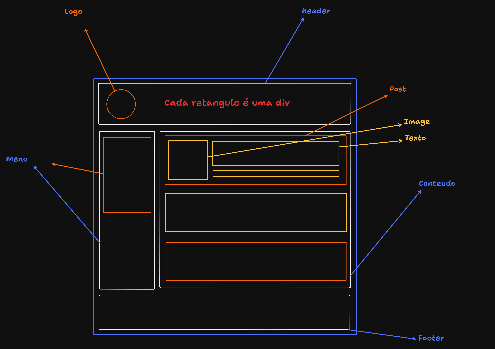

# Estruturação e Formatação de Texto em HTML 

Este exemplo demonstra diferentes formas de estruturar e estilizar texto usando **tags HTML** básicas.  
O objetivo é visualizar como cada tag altera a apresentação e semântica do conteúdo.

---

## 📄 Arquivo: `index.html`

### Elementos utilizados:

- **Texto simples**  
  ```html
  Testando o HTML e sua estrutura
  ```
  Apenas texto padrão.

- **Itálico (`<i>`)**  
  ```html
  <i>HTML</i>
  ```
  Deixa o texto em **itálico**, geralmente usado para destacar termos.

- **Negrito + Sublinhado (`<u><strong>`)**  
  ```html
  <u><strong>HTML</strong></u>
  ```
  Texto em **negrito** e **sublinhado** ao mesmo tempo.

- **Marcação (`<mark>`)**  
  ```html
  <mark>Testando</mark>
  ```
  Destaca o texto com fundo amarelo (como se fosse marca-texto).

- **Sobrescrito (`<sup>`)**  
  ```html
  HTML<sup>2</sup>
  ```
  Exibe texto elevado, útil em fórmulas ou notas (ex: `x²`).

- **Citação em bloco (`<blockquote>`)**  
  ```html
  <blockquote> Testando o HTML e sua estrutura</blockquote>
  ```
  Indica um **bloco de citação**, destacado com recuo.

- **Fonte (`<font>`)** *(obsoleta)*  
  ```html
  <font color="red" face="'Trebuchet MS', Tahoma"> Testando o HTML </font>
  ```
  Define cor e tipo de fonte diretamente no HTML.  
  ⚠️ Essa tag é considerada **deprecated** (obsoleta). O recomendado hoje é usar **CSS**.

---

## 📄 Arquivo: `estrutura.html`

### Estrutura do Site:



## 🚀 Como visualizar

1. Abra o arquivo `index.html` no navegador.  
2. Veja como cada tag afeta a formatação do texto.  
3. Experimente trocar cores, textos e fontes.

---


