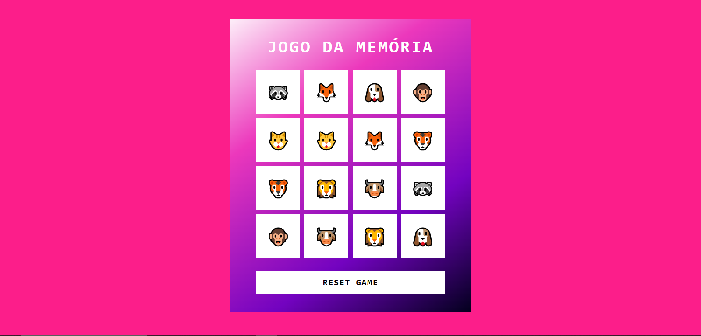

# 🧠 Jogo da Memória

Um simples e divertido **Jogo da Memória** desenvolvido em **HTML, CSS e JavaScript**.  
O objetivo é testar sua memória encontrando os pares de emojis de animais no menor número de jogadas possível!

---

## 🎮 Como funciona

O jogo embaralha os cards a cada início.  
O jogador deve clicar em duas cartas — se forem iguais, permanecem viradas; se forem diferentes, voltam para a posição inicial.  
Quando todos os pares forem encontrados, o jogo é concluído.

---

## 🚀 Tecnologias utilizadas

- **HTML5** → estrutura do jogo  
- **CSS3** → estilo e layout (gradiente, centralização e responsividade)  
- **JavaScript (ES6)** → lógica principal (embaralhamento, checagem e reset)

---

## 🖼️ Demonstração



*Interface colorida e interativa do jogo, com emojis representando os pares de cartas.*

---

## ⚙️ Como rodar o projeto

1. Clone o repositório:
   ```bash
   git clone https://github.com/Carloscb124/FrontEnd.git
   ```

2. Acesse a pasta do jogo:
   ```bash
   cd FrontEnd/Jogo-Memoria
   ```

3. Abra o arquivo `index.html` no navegador:
   ```bash
   start index.html
   ```

---

## 🔁 Reset do jogo

O botão **“Reset Game”** reinicia a partida, embaralhando novamente todas as cartas.

---

## 🧩 Melhorias futuras

- Adicionar contador de tentativas e tempo.  
- Implementar níveis de dificuldade.  
- Inserir efeitos sonoros e animações nas combinações.

---

